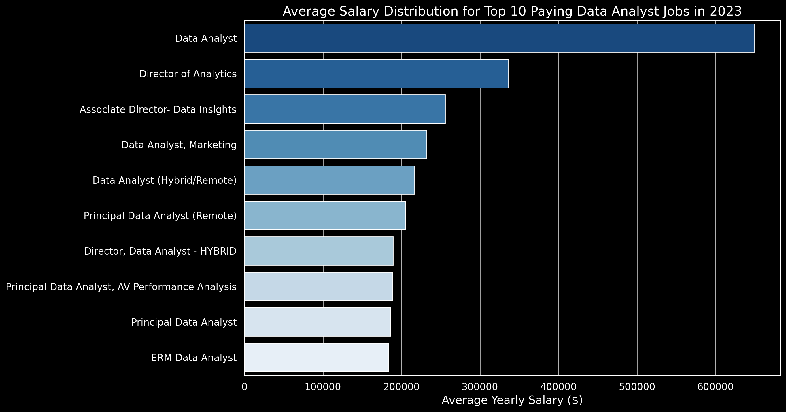

# Introduction
📊 Step into the world of data analytics! This project dives into the data job market, focusing on data analyst roles. It highlights 💰 top-paying positions, 🔥 the most in-demand skills, and ✅ where high demand meets high salaries in the field of analytics.

💻 Want to see the SQL queries? Find them here: [project_sql folder](/project_sql/)
# Background
This project was inspired by the need to better navigate the data job market and identify the most valuable skills for aspiring data analysts. The goal was to uncover which roles offer the highest salaries, which skills are most in demand, and how professionals can align their learning with market needs.

The dataset comes from Luke Barousse course,
containing insights on job titles, salaries, locations, and key skills.

Through my SQL queries, I set out to answer the following questions:

1. What are the top-paying data analyst roles?  
2. Which skills are required for these high-paying positions?
3. Which skills are most in demand for data analysts?
4. Which skills are most strongly linked to higher salaries?
5. What are the best skills to learn for career growth?

# Tools I Used
To explore the data analyst job market, I relied on a set of powerful tools:
- **SQL** – The foundation of my analysis, enabling me to query databases and extract meaningful insights.
- **PostgreSQL** – The database management system I used to store and manage job posting data.
- **Visual Studio Code** – My primary environment for writing and executing SQL queries.
- **Git & GitHub** – Essential for version control, collaboration, and tracking the progress of my SQL scripts and analysis.

# The Analysis
Each query in this project was designed to explore a specific aspect of the data analyst job market. Here’s how I approached each research question:

### 1. Top-Paying Data Analyst Jobs

To uncover the highest-paying roles, I filtered data analyst positions by average annual salary and location, with a particular focus on remote opportunities. This analysis highlights where the most lucrative positions in the field can be found.

```sql
SELECT
    job_id,
    job_title,
    job_location, 
    job_schedule_type,
    salary_year_avg,
    job_posted_date,
    name AS company

FROM job_postings_fact
LEFT JOIN company_dim ON job_postings_fact.company_id = company_dim.company_id
WHERE 
    job_title_short = 'Data Analyst' AND 
    job_location = 'Anywhere' AND
    salary_year_avg IS NOT NULL

ORDER BY salary_year_avg DESC
LIMIT 10
```
Top Data Analyst Jobs in 2023 – Overview:

- **Broad Salary Potential**: The top 10 highest-paying data analyst positions range from $184,000 to $650,000, highlighting the field’s strong earning opportunities.

- **Varied Employers**: Leading companies such as SmartAsset, Meta, and AT&T offer these competitive salaries, showing demand across multiple industries.

- **Diverse Roles**: Job titles vary widely, from Data Analyst to Director of Analytics, reflecting the different specializations and career paths within data analytics.



*Bar graph visualizing the salary for the top 10 salaries for data analysts*

### 2. Skills for Top Paying Jobs
```sql
WITH top_paying_jobs AS (
    SELECT	
        job_id,
        job_title,
        salary_year_avg,
        name AS company_name
    FROM
        job_postings_fact
    LEFT JOIN company_dim ON job_postings_fact.company_id = company_dim.company_id
    WHERE
        job_title_short = 'Data Analyst' AND 
        job_location = 'Anywhere' AND 
        salary_year_avg IS NOT NULL
    ORDER BY
        salary_year_avg DESC
    LIMIT 10
)

SELECT 
    top_paying_jobs.*,
    skills
FROM top_paying_jobs
INNER JOIN skills_job_dim ON top_paying_jobs.job_id = skills_job_dim.job_id
INNER JOIN skills_dim ON skills_job_dim.skill_id = skills_dim.skill_id
ORDER BY
    salary_year_avg DESC;
```
To identify the skills behind the highest-paying roles, I linked job postings with skills data, revealing what employers prioritize when offering top compensation

Here's the breakdown of the most demanded skills for the top 10 highest paying data analyst jobs in 2023:

- SQL is leading with a bold count of 8.
- Python follows closely with a bold count of 7.
- Tableau is also highly sought after, with a bold count of 6. Other skills like R, Snowflake, Pandas, and Excel show varying degrees of demand.


*Bar graph visualizing the count of skills for the top 10 paying jobs for data analysts;*

### 3. In-Demand Skills for Data Analysts

This query helped identify the skills most frequently requested in job postings, directing focus to areas with high demand.
```sql
SELECT 
    skills,
    COUNT(skills_job_dim.job_id) AS demand_count
FROM job_postings_fact
INNER JOIN skills_job_dim ON job_postings_fact.job_id = skills_job_dim.job_id
INNER JOIN skills_dim ON skills_job_dim.skill_id = skills_dim.skill_id
WHERE
    job_title_short = 'Data Analyst' 
    AND job_work_from_home = True 
GROUP BY
    skills
ORDER BY
    demand_count DESC
LIMIT 5;
```
Most In-Demand Data Analyst Skills in 2023:

- **SQL** and **Excel**: Still core requirements, highlighting the importance of strong foundations in data management and spreadsheet analysis.

- **Programming & Visualization Tools**: Skills in Python, Tableau, and Power BI are critical, reflecting the growing demand for technical expertise in data storytelling and business decision-making.

| Skills       | Demand Count             |
|:--------- |:----------------|
| SQL     | 7291     |
| Excel     | 4611   | 
| Python      | 4330         | 
| Tableau      | 3745         | 
| Power BI      | 2609         | 
*Table of the demand for the top 5 skills in data analyst job postings*
### 4. Skills Based on Salary
Exploring the average salaries associated with different skills revealed which skills are the highest paying.
```sql
SELECT 
    skills,
    ROUND(AVG(salary_year_avg), 0) AS avg_salary
FROM job_postings_fact
INNER JOIN skills_job_dim ON job_postings_fact.job_id = skills_job_dim.job_id
INNER JOIN skills_dim ON skills_job_dim.skill_id = skills_dim.skill_id
WHERE
    job_title_short = 'Data Analyst'
    AND salary_year_avg IS NOT NULL
    AND job_work_from_home = True 
GROUP BY
    skills
ORDER BY
    avg_salary DESC
LIMIT 25;
```
Top-Paying Skills for Data Analysts:

- **Big Data & Machine Learning**: High salaries go to analysts proficient in big data tools (PySpark, Couchbase), machine learning platforms (DataRobot, Jupyter), and Python libraries (Pandas, NumPy), highlighting the premium on data processing and predictive modeling expertise.

- **Development & Deployment Skills**: Proficiency with tools like GitLab, Kubernetes, and Airflow bridges analytics and engineering, with employers rewarding the ability to automate workflows and manage data pipelines efficiently.

- **Cloud Computing**: Expertise in platforms such as Elasticsearch, Databricks, and GCP reflects the rising demand for cloud-based analytics, making cloud proficiency a strong driver of higher compensation.

| Skill        | Average Salary ($) |
|--------------|--------------------|
| PySpark      | 208,172            |
| Bitbucket    | 189,155            |
| Couchbase    | 160,515            |
| Watson       | 160,515            |
| DataRobot    | 155,486            |
| GitLab       | 154,500            |
| Swift        | 153,750            |
| Jupyter      | 152,777            |
| Pandas       | 151,821            |
| Elasticsearch| 145,000            |
*Table of the average salary for the top 10 paying skills for data analysts

### 5. Most Optimal Skills to Learn

Combining insights from demand and salary data, this query aimed to pinpoint skills that are both in high demand and have high salaries, offering a strategic focus for skill development.
```sql
WITH skills_demand AS (
SELECT skills_dim.skill_id,
    skills_dim.skills,
    COUNT(skills_job_dim.job_id) AS demand_count
FROM job_postings_fact
INNER JOIN skills_job_dim ON job_postings_fact.job_id = skills_job_dim.job_id 
INNER JOIN skills_dim ON skills_job_dim.skill_id = skills_dim.skill_id
WHERE job_title_short = 'Data Analyst' AND 
        job_work_from_home = True AND
         salary_year_avg IS NOT NULL
GROUP BY skills_dim.skill_id
), average_salary AS (

SELECT skills_job_dim.skill_id,
    ROUND (AVG(job_postings_fact.salary_year_avg), 0) AS avg_salary
FROM job_postings_fact
INNER JOIN skills_job_dim ON job_postings_fact.job_id = skills_job_dim.job_id 
INNER JOIN skills_dim ON skills_job_dim.skill_id = skills_dim.skill_id
WHERE job_title_short = 'Data Analyst'
    AND salary_year_avg IS NOT NULL
 AND job_work_from_home = True
GROUP BY skills_job_dim.skill_id
)

SELECT 
    skills_demand.skill_id,
    skills_demand.skills,
    demand_count,
    avg_salary
FROM   
    skills_demand
INNER JOIN average_salary ON skills_demand.skill_id = average_salary.skill_id
WHERE 
    demand_count > 10
ORDER BY 
    avg_salary DESC,
    demand_count DESC
LIMIT 25
```

| Skill ID | Skill       | Demand Count | Average Salary ($) |
|----------|-------------|--------------|--------------------|
| 8        | Go          | 27           | 115,320            |
| 234      | Confluence  | 11           | 114,210            |
| 97       | Hadoop      | 22           | 113,193            |
| 80       | Snowflake   | 37           | 112,948            |
| 74       | Azure       | 34           | 111,225            |
| 77       | BigQuery    | 13           | 109,654            |
| 76       | AWS         | 32           | 108,317            |
| 4        | Java        | 17           | 106,906            |
| 194      | SSIS        | 12           | 106,683            |
| 233      | Jira        | 20           | 104,918            |

*Table of the most optimal skills for data analyst sorted by salary*

Most Valuable Skills for Data Analysts in 2023

- **Programming Languages**: Python (236 demand count, ~$101,397 average salary) and R (148, ~$100,499) remain highly sought after. Their widespread use shows they’re essential skills, though competition keeps salaries moderate.

- **Cloud Technologies**: Expertise in Snowflake, Azure, AWS, and BigQuery is in strong demand, with competitive salaries, underscoring the rising importance of cloud platforms and big data tools in analytics.

- **Business Intelligence & Visualization**: Tools like Tableau (230 demand count, ~$99,288) and Looker (49, ~$103,795) demonstrate the central role of BI and visualization in turning data into insights.

- **Databases**: Skills in Oracle, SQL Server, and NoSQL databases (salaries between ~$97,786–$104,534) highlight the continued need for reliable data storage, retrieval, and management expertise.

# What I Learned
Leveling Up My SQL Skills 🚀

- 🧩 Complex Query Crafting: Mastered advanced SQL — from seamless table joins to wielding WITH clauses for sleek temp-table magic.
- 📊 Data Aggregation: Harnessed the power of GROUP BY and aggregate functions like COUNT() and AVG() to turn raw data into clear insights.
- 💡 Analytical Wizardry: Transformed real-world questions into actionable queries, sharpening my problem-solving and insight-generation superpowers.
# Conclusions

### Insights: 

From the analysis, several key takeaways emerged:

- **Top-Paying Roles**: Remote data analyst jobs can reach salaries as high as $650,000, highlighting the impressive earning potential in the field.

- **Skills Driving High Salaries**: Advanced SQL proficiency consistently appears as a requirement for top-paying positions, confirming its status as a must-have skill.

- **Most In-Demand Skill**: SQL also dominates in demand across the job market, making it essential for anyone pursuing a data analyst career.

- **Niche Skills with Premium Pay**: Specialized tools like SVN and Solidity command some of the highest average salaries, showing the value of unique, less common expertise.

- **Optimal Market Value Skills**: SQL strikes the balance of being both highly demanded and well-compensated, making it one of the most strategic skills to master.

### Closing Thoughts:

This project not only strengthened my SQL capabilities but also revealed actionable insights about the data analyst job market. The findings highlight which skills to prioritize for both career growth and salary potential. For aspiring data analysts, focusing on high-demand, high-salary skills is a clear way to stand out in a competitive field. Ultimately, success comes from continuous learning and adapting to new trends, ensuring long-term growth in data analytics.